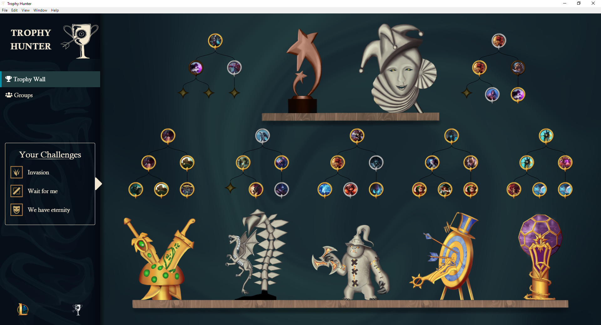

# Trophy Hunter 

## What is "Trophy Hunter"?
Trophy Hunter creates your own personalized trophy wall based on the challenges that you complete. It is designed to be enjoyable for all kind of League players, and aims to provide even casual players with something that is nice to look at and that they can be proud of.
The challenges are meant to be fun, help players improve, push them to think outside the box and emphasize teamplay. The more challenges you complete, the more awesome your wall will become!

https://www.youtube.com/watch?v=oc2CF3OyAFA

## How do I get to use it?
https://github.com/TiFu/riot-api-challenge-2018/releases
Download and launch the installer found in the link above. Log into your League Client to automatically log into "Trophy Hunter" as well. Now you are ready to go. Just play any matchmade game and it will count towards your challenges. Good luck!

## Is that custom art?
Aside from the champion/skin art used in the tree (who would have guessed) and the known role icons, almost everything was drawn by us. The Trophy Hunter icon, the backgrounds, the picture borders, the shelves, the background and the trophies. The lane trophies themselves were obviously inspired from themes from our beloved game.

 

## What does the future hold?
More challenges, more trophies. We want to create an option where you can search for an see the trophy walls of other players. We have the backend tools needed to create a mode, where you can create challenges with your own criteria and share it to challenge your friends.

## FAQ
### I cannot find my friends to invite.
In this case, let them use the app and connect to the client once. This should fix it.
